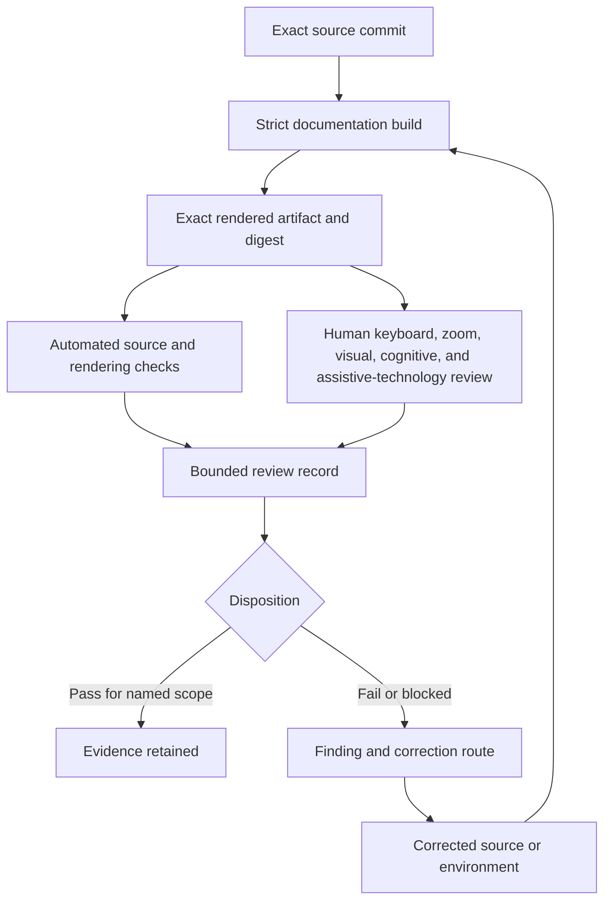

# Accessibility and review evidence

## Status

`DOCUMENTED_NOT_CERTIFIED`

This guide defines how QSO-GENOMES documentation, diagrams, examples, and generated review artifacts should be evaluated for accessibility. It does not certify the current site, approve GitHub Pages publication, validate a genome contract, accept a compatibility set, or authorize operational admission.

Accessibility evidence is exact-artifact evidence. A source Markdown review does not certify a rendered site, a successful MkDocs build does not certify assistive-technology behavior, and a passing contract validator does not certify that a human reviewer can understand the result.

## Review surfaces

Each surface is reviewed independently because they expose different failure modes.

| Surface | Examples | Evidence required | Not established by a pass |
|---|---|---|---|
| Source documentation | Markdown, ADRs, task and release records | heading, link, table, alternative-text, language, and consistency review | rendered behavior or publication approval |
| Rendered documentation | exact MkDocs artifact | keyboard navigation, focus, zoom, reflow, contrast, landmarks, responsive tables, and link-purpose review | contract validity or genome acceptance |
| Diagrams | Mermaid source and rendered diagram | prose equivalent, relationship parity, non-color meaning, readable labels, and fallback behavior | architecture approval |
| Contract tables | identity, state, gate, and fixture matrices | headers, reading order, abbreviations, status explanation, and small-screen behavior | semantic acceptance |
| Code and data examples | JSON, YAML, shell, identifiers, digests | language labels, copy boundaries, line wrapping, explanation, and machine-readable source identity | executable safety or operational authority |
| Generated evidence | reports, hash manifests, logs, retained artifacts | exact source and workflow binding, readable summaries, limitations, and correction links | independent verification or certification |
| Downstream presentation | QSO-STUDIO, AionUi, other consumers | separately reviewed exact implementation and artifact | coverage by this repository review |

## Evidence states

Use one of the following states for every reviewed surface:

- `NOT_REVIEWED` — no bounded review has been recorded.
- `PARTIAL` — some requirements were evaluated; omissions are named.
- `PASS` — the named requirements passed for the exact artifact and environment.
- `FAIL` — one or more named requirements failed.
- `BLOCKED` — the review could not proceed because the artifact, environment, reviewer, authority, or prerequisite was unavailable.
- `UNKNOWN` — evidence is ambiguous or cannot be reconstructed.
- `SUPERSEDED` — a newer exact artifact replaced this result.
- `WITHDRAWN` — the evidence or claim was intentionally withdrawn while preserving provenance.
- `CORRECTED` — the record was corrected and links both the prior and replacement evidence.

A `PASS` applies only to the named requirements, artifact digest, environment, and review date. It does not propagate automatically to a descendant commit or regenerated site.

## Evidence flow



Prose equivalent: an exact source commit is built with pinned documentation tooling. The resulting site is retained as an exact artifact with a digest. Automated checks and human reviews examine that same artifact. Their results are combined in a bounded record that either preserves a scoped pass or opens a finding. A correction creates a new source generation and new evidence; it does not overwrite the earlier record.

## Minimum evidence binding

Every review record should identify:

- repository, branch, pull request, base commit, and exact reviewed head;
- documentation workflow and exact tool versions;
- rendered artifact identifier, digest, size, and retention or archive location;
- pages, diagrams, tables, examples, and states included in scope;
- browser, operating system, viewport, zoom, input method, and assistive technology;
- automated checks and manual procedures performed;
- result for each requirement, including failures and untested conditions;
- reviewer identity or approved reviewer role;
- discovered limitations, privacy restrictions, and inaccessible dependencies;
- correction, withdrawal, supersession, and rollback references;
- explicit authority flags showing that the record does not approve publication, release, compatibility, admission, capability, or deployment.

## Source-documentation requirements

### Structure and navigation

- Use one level-one heading per page.
- Do not skip heading levels where the skip would obscure document structure.
- Use descriptive link text rather than bare URLs or repeated “click here” labels.
- Keep navigation labels distinct and consistent with page headings.
- Introduce acronyms and specialized identifiers before relying on them.
- Place warnings and blocked-state notices before procedures that could otherwise be misread as approved actions.

### Tables

- Use explicit column headers.
- Keep status and authority columns text-complete; do not communicate meaning by color alone.
- Explain abbreviations and controlled vocabularies near the table.
- Avoid using tables solely for visual layout.
- Provide a prose summary when a dense matrix is essential to a decision.

### Diagrams

- Every diagram must have a prose equivalent that names the same nodes, edges, direction, uncertainty, and blocked transitions.
- Labels must remain meaningful without color.
- Proposed, observed, accepted, blocked, superseded, corrected, and revoked states must be textually distinct.
- A rendered-diagram failure must not hide the architecture or lifecycle meaning.

### Examples and machine-readable records

- Label code fences with the correct language where supported.
- Explain whether an example is normative, illustrative, synthetic, incomplete, or deliberately non-executable.
- Do not embed credentials, personal data, private evidence, live endpoints, or operational capability material.
- Preserve line wrapping and horizontal-scroll alternatives so long identifiers remain inspectable at 200% and 400% zoom.
- Provide human-readable explanations for machine-readable status and error records.

## Rendered-artifact review

### Keyboard and focus

Review the exact rendered artifact without a pointing device:

1. enter the page at the browser address bar or first content landmark;
2. traverse navigation, links, code-copy controls, and any interactive elements;
3. confirm focus order follows reading order;
4. confirm focus remains visible and is not obscured;
5. confirm there is no keyboard trap;
6. confirm repeated navigation can be bypassed where the theme supports it;
7. confirm errors and blocked states are reachable and understandable.

### Zoom and reflow

At 200% and 400% browser zoom:

- primary text should reflow without two-dimensional scrolling;
- navigation should remain discoverable and operable;
- tables may use bounded horizontal scrolling, but their headers and status meaning must remain available;
- code blocks and long hashes may scroll horizontally without causing the full page to scroll;
- warnings, admonitions, and diagrams must not overlap or truncate essential text;
- line height and spacing must preserve readable grouping.

### Contrast and non-color encoding

- Text, focus indicators, links, warnings, and state labels require sufficient contrast for the chosen standard.
- Links and statuses require a non-color cue.
- Diagrams must use labels, line styles, shapes, or text in addition to color.
- Syntax highlighting must not be the only way to distinguish data roles.

### Screen-reader review

At minimum, review:

- page title and heading hierarchy;
- navigation landmarks and link purpose;
- table headers and reading order;
- admonition and warning announcements;
- code-block language and boundaries;
- diagram alternative discoverability;
- state and authority descriptions;
- correction and supersession links;
- pronunciation or expansion of frequently used acronyms where ambiguity is likely.

### Cognitive and epistemic accessibility

The documentation must make it possible to distinguish:

- declarative data from executable behavior;
- existence from implementation;
- implementation from validation;
- validation from acceptance;
- capability declaration from demonstrated capability;
- local validity from operational admission;
- execution from reconciliation;
- accessibility review from accessibility certification;
- documentation readiness from publication, release, or deployment approval.

Use short status summaries, explicit non-goals, stable terminology, concrete examples, and progressive disclosure. Avoid presenting dense identifier lists without an explanation of why each identity remains distinct.

### Motion, remote assets, and low-bandwidth use

The current site is expected to be static and should not require animation. Any future motion must respect reduced-motion preferences and preserve a static equivalent. Documentation should remain usable when remote fonts, scripts, diagrams, or analytics fail to load. Essential meaning must remain in repository-controlled text and assets.

## Privacy and public-artifact boundary

Accessibility evidence may describe environments and assistive technologies, but public records should minimize personal information. Do not publish reviewer medical information, private account identifiers, device serial numbers, private browsing data, protected genome evidence, credentials, or confidential review notes.

When a complete accessibility report cannot be public, publish a bounded summary that identifies the exact artifact, scope, disposition, limitations, and an approved route to the protected evidence.

## Documentation-only review record

The following template is illustrative and non-authorizing:

```yaml
profile: qso-genomes-accessibility-review/v0
status: PARTIAL
source:
  repository: aevespers2/QSO-GENOMES
  commit: <exact-head>
rendered_artifact:
  workflow_run: <run-id>
  artifact_id: <artifact-id>
  digest: sha256:<digest>
environment:
  operating_system: <name-and-version>
  browser: <name-and-version>
  viewport: <width-x-height>
  zoom_levels: [100, 200, 400]
  input_methods: [keyboard]
  assistive_technology: [<name-and-version-or-not-reviewed>]
scope:
  pages: [<paths>]
  requirements: [structure, links, keyboard, focus, reflow, contrast, screen_reader, cognitive_access]
results:
  pass: [<requirements>]
  fail: [<requirements>]
  blocked: [<requirements>]
limitations: [<known-limitations>]
correction:
  supersedes: <record-or-null>
  finding_ids: [<ids>]
authority:
  accessibility_certification: false
  pages_publication: false
  compatibility_acceptance: false
  genome_admission: false
  capability_issuance: false
  release: false
  deployment: false
```

## Fail-closed stop conditions

Stop and record `FAIL`, `BLOCKED`, or `UNKNOWN` when:

- the reviewed source or rendered artifact cannot be identified exactly;
- a diagram has no equivalent prose or materially disagrees with it;
- a release, admission, capability, or authority state depends only on color or visual position;
- keyboard focus is lost, hidden, trapped, or reordered materially;
- essential content becomes unavailable at 200% or 400% zoom;
- machine-readable examples contain private, credential, or operational material;
- the review record omits limitations or overstates certification;
- a corrected or superseded result is presented as current without linkage;
- generated evidence is tied to another commit or cannot be reproduced;
- a source-only or automated check is represented as manual assistive-technology certification.

## Reviewer onboarding

A reviewer should:

1. read the repository status in `README.md`, `taskchain.md`, and `release.md`;
2. build the documentation from the exact submitted head;
3. retain the exact rendered artifact and digest before review;
4. read the architecture, contracts, diagrams, capability-evidence, and admission/projection guides;
5. complete source and rendered checks against the same artifact;
6. record all untested requirements and environmental limitations;
7. open findings without silently repairing history or changing contract meaning;
8. require new exact-head evidence after any correction;
9. keep accessibility disposition separate from contract, genome, admission, publication, release, and deployment decisions.

## FYSA-120 capability map

This guide applies:

- `011-B` and `011-E` for accessible diagrams, non-color meaning, prose equivalence, and cross-modal consistency;
- `012-A`, `012-B`, `012-D`, and `012-E` for information architecture, requirements writing, documentation testing, terminology control, and lifecycle synchronization;
- `018-B`, `018-D`, and `018-E` for evidence classification, reviewer onboarding, responsibility mapping, retention, and contested-history preservation;
- `019-B`, `019-C`, and `019-D` for plain language, screen-reader and cognitive access, and uncertainty and risk communication;
- `031-A`, `031-D`, and `031-E` for acceptance criteria, rendered-artifact validation, regression prevention, and assurance maintenance.

Proposed non-authoritative subdivision: **`019-R — Exact-artifact accessibility evidence for declarative contract and machine-readable governance documentation`**.

Taxonomy membership is a planning map. It is not proof of accessibility competence or certification.

## Remaining decisions

The repository still needs explicit decisions for:

- the accessibility standard and conformance level;
- supported browsers, operating systems, viewports, and assistive technologies;
- approved reviewer roles and correction ownership;
- protected evidence retention and public-summary policy;
- rendered-artifact archival duration;
- GitHub Pages publication authority;
- independent certification, if required.

Until those decisions and exact rendered evidence exist, the status remains `DOCUMENTED_NOT_CERTIFIED`.

<!-- QSO-CONSENT-CAPACITY-LOCK-v1 -->
