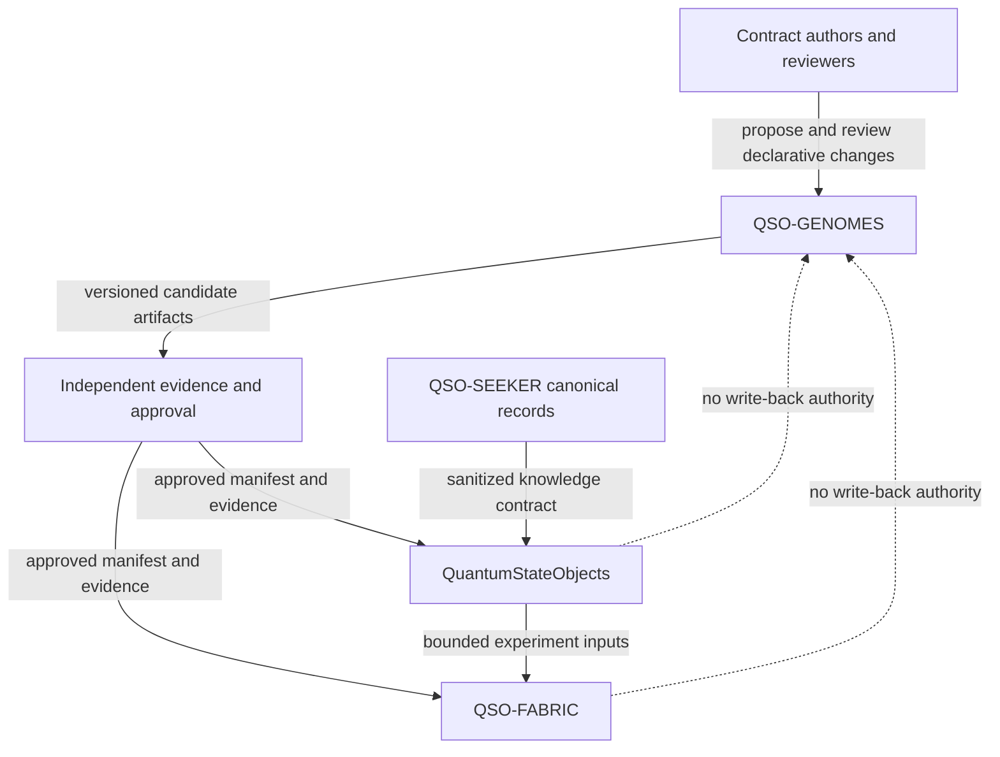
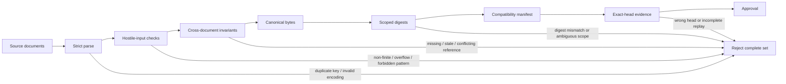

# Architecture

## Architectural role

QSO-GENOMES is a **contract authority**, not a runtime. Its architecture is organized around immutable data, deterministic interpretation, reviewable identity, and evidence-preserving release controls.

The repository should remain understandable as five layers:

1. **Source contracts** — genome, supervisory, immutable-policy, and forbidden-capability documents.
2. **Schemas and references** — structural rules, identifiers, versions, and cross-document links.
3. **Deterministic validation** — canonical loading, invariant checks, migration checks, and hostile-input rejection.
4. **Compatibility manifest** — the approved set boundary, source-derived identity, paths, versions, and digest scopes.
5. **Release evidence** — exact-head logs, reports, checksums, provenance, review disposition, downstream replay, and rollback.

## Context diagram

## Trust boundaries

### Boundary A — author input to repository data

Human-authored JSON, YAML, Markdown, or generated candidate data is untrusted until it passes structural, semantic, reference, identity, and hostile-input validation. Parsing success is only the first check.

### Boundary B — repository data to compatibility manifest

A manifest must not invent identity-bearing metadata. Artifact identifiers, schema versions, contract versions, and references should be derived from the source documents and checked for uniqueness and consistency before the manifest is accepted.

### Boundary C — candidate to accepted release

Candidate branches, pull requests, generated reports, and workflow configuration are review inputs. Only one immutable, mergeable, explicitly approved head may become the release source.

### Boundary D — release to downstream consumer

Downstream repositories consume the approved set read-only. They must verify the complete manifest and every required artifact before use. Partial acceptance is forbidden unless a later contract explicitly defines a safe, versioned partial mode.

### Boundary E — consumer runtime to genome authority

A runtime may record a proposed preference change, but it cannot modify an immutable field or commit an upstream genome. Repository writes remain an external human-controlled process.

## Logical components

| Component | Responsibility | Must not do |
|---|---|---|
| Genome documents | declare identity, purpose, bounded tendencies, limits, and freeze behavior | contain executable instructions |
| Supervisory documents | declare approved review surfaces and bounded review authority | execute code or silently replace human approval |
| Schemas | define structure, required fields, types, and allowed extensions | normalize invalid input into acceptance |
| Immutable protocol | define non-weakenable safety and dignity constraints | permit local overrides |
| Forbidden-capability rules | exclude dangerous or out-of-scope authority | become optional consumer advice |
| Migration records | define explicit source, target, compatibility, and rollback semantics | infer migrations from similar names |
| Canonicalizer | produce deterministic bytes from validated data | hide duplicate keys or non-finite values |
| Validator | enforce cross-document invariants and fail-closed rules | accept an incomplete set |
| Compatibility manifest | identify the complete approved set and digest scopes | rely on branch names as identity |
| Evidence bundle | bind claims to exact commit, tools, reports, and downstream replay | certify a different head than the reviewed one |

## Artifact-set pipeline

## Identity model

Identity exists at several scopes and must be named precisely:

- **Artifact identity** — canonical bytes for one validated source document.
- **Contract identity** — stable identifier and version declared by that source document.
- **Set identity** — the complete compatibility manifest, including all consumer-relevant metadata.
- **Source identity** — the exact accepted repository commit and archive from which the set was produced.
- **Evidence identity** — checksums and provenance for reports, fixtures, logs, and downstream replay.

A digest field should state which scope it covers. A hash of a list of artifact hashes is not automatically equivalent to a hash of every identity-bearing manifest field.

## Failure behavior

The architecture is fail closed. The complete candidate or release set is rejected when any required condition cannot be proven, including:

- missing or unknown required artifact;
- duplicate key, path, identity, reference, migration, or review surface;
- unresolved or circular reference not explicitly allowed;
- schema or contract-version mismatch;
- immutable-policy conflict or weakening;
- unapproved supervisory identity or alias;
- non-finite or overflowed numeric input;
- canonicalization disagreement;
- artifact or set digest mismatch;
- provenance that cannot be reached from the reviewed head;
- evidence produced from a different head;
- downstream consumer disagreement.

## Repository relationship boundaries

### QuantumStateObjects

Owns runtime instantiation, state transitions, freeze-point handling, and local enforcement. It must keep upstream immutable fields outside QSO-writable state and must not import mutable repository code as part of genome interpretation.

### QSO-FABRIC

Owns bounded experiment coordination and multi-QSO evidence flow. It may require stricter limits but must validate the same accepted genome-set identity as `QuantumStateObjects`.

### QSO-SEEKER

Owns bounded retrieval and sanitization. Genome documents may describe knowledge preferences but do not grant direct network authority.

### QSO-DIGITALIS and other future repositories

No dependency should be inferred from a repository name. A new relationship requires an approved versioned contract, explicit trust boundary, migration plan, tests, and rollback record.

## Architectural change rule

Any change to identity, immutable semantics, forbidden capabilities, canonicalization, digest scope, migration meaning, supervisory authority, or consumer failure behavior is an architectural contract change. It requires an ADR or equivalent decision record, updated fixtures, versioning impact, downstream review, and release-plan synchronization.

<!-- QSO-CONSENT-CAPACITY-LOCK-v1 -->
