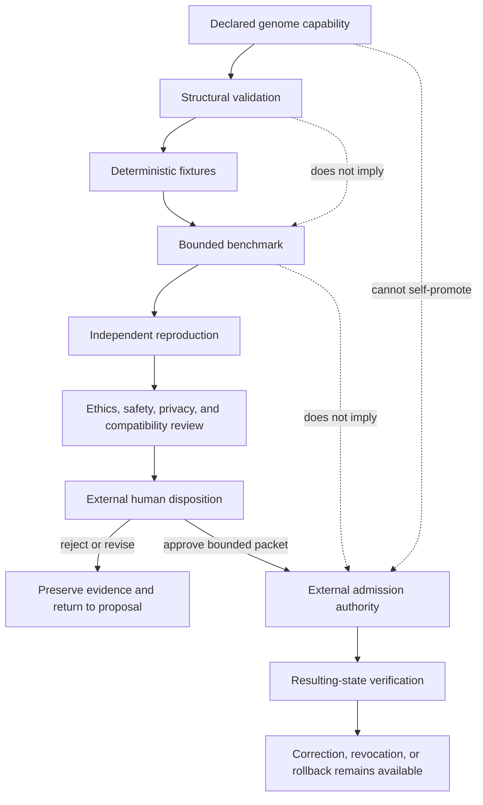

# Capability Evidence and Self-Edit Review

## Status and purpose

**Disposition:** `DOCUMENTED_NOT_ADMITTED`

This guide defines how reviewers distinguish a genome's declared capability from demonstrated capability, evaluate proposed self-edits, and preserve immutable ethics, provenance, rollback, and external authorization boundaries. It applies to Atlas, Nova, Orion, Lyra, supervisory records, and future declarative genome candidates.

The guide is documentation and review infrastructure only. It does not approve a genome, certify competence, admit a runtime, issue a capability, authorize a mutation, select a canonical compatibility set, or permit an external commit.

## Core invariants

1. A declaration is not a demonstration.
2. A passing schema or digest check demonstrates structural conformance only.
3. A successful benchmark demonstrates only the measured behavior under the recorded conditions.
4. A genome cannot approve, commit, activate, or canonicalize its own self-edit.
5. Immutable ethics and forbidden-capability boundaries are not genome-writable state.
6. Missing, conflicting, stale, replayed, unverifiable, or privacy-restricted evidence remains explicit and fails closed.
7. Every accepted change requires an independent rollback target and resulting-state verification.

## Evidence ladder

| Level | State | Minimum evidence | What may be claimed | What remains prohibited |
|---:|---|---|---|---|
| 0 | `DECLARED` | Genome field or documentation statement | The capability is declared | Any claim that the capability works |
| 1 | `STRUCTURALLY_VALID` | Schema, canonicalization, policy-reference, lineage, and manifest checks | The declaration is well-formed for one profile | Behavioral competence, safety, admission, or authority |
| 2 | `FIXTURE_DEMONSTRATED` | Versioned deterministic positive and hostile fixtures | The implementation passed the named fixtures | Generalization beyond fixture scope |
| 3 | `BENCHMARK_DEMONSTRATED` | Reproducible benchmark, environment, controls, uncertainty, and retained evidence | Performance on the exact benchmark | Broad capability, real-world reliability, or operational admission |
| 4 | `INDEPENDENTLY_REPRODUCED` | Independent implementation or reviewer reproduces the result | Reproduction under recorded conditions | Unbounded transfer or authority |
| 5 | `ADMISSION_ELIGIBLE` | Required security, privacy, ethics, compatibility, and rollback gates pass | Eligible for an external admission decision | Self-admission, capability issuance, or activation |
| 6 | `OPERATIONALLY_ADMITTED` | Separate authority admits an exact artifact set for a bounded profile | Bounded use under the admission record | Canonical acceptance outside that scope |
| 7 | `RESULTING_STATE_VERIFIED` | Execution, reconciliation, correction, revocation, and rollback evidence | The bounded admitted use reached the verified state | Permanent or universal competence claims |

Promotion must be monotonic in evidence, never in authority. Evidence at one level cannot silently create a higher-level state.

## Declared versus demonstrated capability map

The initial four genomes declare different emphases. Reviewers must map each declaration to an explicit evaluation plan rather than inferring ability from names, interests, prose, weights, or architectural coherence.

| Genome | Typical declared capability classes | Demonstration needed before stronger claims | Principal review risk |
|---|---|---|---|
| Atlas | mathematical synthesis, cross-domain modeling, explanation | held-out problems, assumption tracking, dimensional and formal checks, independent reproduction | persuasive synthesis masking unsupported assumptions |
| Nova | verification, anomaly analysis, evidence comparison | calibrated detection corpus, false-positive and false-negative analysis, adversarial and ambiguous cases | treating anomaly or heuristic match as proof |
| Orion | architecture, interface design, systems integration | contract fixtures, failure injection, migration and rollback witnesses, consumer compatibility | coherent design being mistaken for implementation authority |
| Lyra | language, interpretation, emotional-context recognition | ambiguity, consent, manipulation-resistance, cultural and accessibility evaluations | understanding being converted into influence or attachment exploitation |

These mappings are review prompts, not certified capability inventories.

## Review graph



### Prose equivalent

A declared capability first receives structural validation. It may then be tested with deterministic fixtures, a bounded benchmark, and an independent reproduction. Separate ethics, safety, privacy, and compatibility review precedes an external human disposition. Rejected or incomplete proposals return to review with their evidence preserved. An approved packet may be considered by a separate admission authority, after which resulting-state verification and correction, revocation, and rollback remain mandatory. The genome cannot move itself directly from declaration, validation, or benchmark success to operational admission.

## Self-edit classes

### Class A — ordinary bounded mutable-field adjustment

Candidate examples include approved goal weights, interests, communication preferences, and other fields explicitly declared mutable by the accepted schema.

Requirements:

- exact prior artifact and manifest identities;
- JSON Pointer or equivalent path for every changed field;
- old value, proposed value, per-freeze delta, and cumulative drift;
- schema-authorized range and numeric finiteness;
- rationale, source evidence, uncertainty, and expected effects;
- affected consumers and compatibility analysis;
- hostile tests, independent validation, rollback target, and external disposition.

### Class B — versioned migration

Any new mutable key, new interest class, changed interpretation rule, schema change, canonicalization change, or semantic broadening is a migration, not an ordinary weight adjustment.

Requirements include source and target schemas, loss accounting, transformation provenance, consumer dispositions, correction and revocation propagation, rollback, and restored-state evidence.

### Class C — immutable-policy or forbidden-capability change

This class is not a genome self-edit. It requires a separately versioned constitutional or policy migration, independent ethics and safety review, explicit human authorization, and downstream replay. Until accepted, the existing exact immutable policy remains binding.

### Class D — authority-bearing or operational change

A proposed credential, capability, admission, execution permission, repository write, release, deployment, payment, signing, key-custody, recovery, or canonical-state change is outside genome authority and must be rejected from the genome packet.

## Required self-edit packet

Every proposed edit must bind:

```yaml
profile: qso-genome-self-edit-review/v1
proposal_id: <immutable proposal identity>
source:
  repository: aevespers2/QSO-GENOMES
  commit: <exact source commit>
  compatibility_manifest_id: <manifest identity>
  artifact_path: <genome path>
  artifact_id: <genome artifact identity>
  artifact_digest: <artifact-byte digest>
  freeze_id: <source freeze or review generation>
changes:
  - path: <JSON Pointer or equivalent>
    classification: ordinary_mutable | migration | prohibited
    old_value: <exact prior value>
    proposed_value: <exact proposed value>
    per_freeze_delta: <finite bounded value or not_applicable>
    cumulative_drift: <finite bounded value or not_applicable>
    schema_authority: <schema field and version>
    rationale: <evidence-bounded explanation>
evidence:
  sources: [<claim-source references>]
  fixtures: [<fixture identities>]
  benchmark: <optional exact benchmark record>
  independent_review: <review record or pending>
impact:
  consumers: [<exact consumer heads and profiles>]
  privacy: <classification and minimization result>
  security: <threat and capability-boundary result>
  ethics: <immutable-policy comparison result>
  compatibility: <compatible | migration_required | rejected>
rollback:
  target_artifact_id: <exact prior artifact>
  procedure: <bounded restoration procedure>
  verification: <restored-state witness requirements>
disposition:
  status: proposed | revise | rejected | approved_for_external_admission_review
  authority_effect: none
  reviewer: <external authorized reviewer or pending>
```

The packet must not contain live credentials, secrets, private evidence unsuitable for the repository, or an assertion that the genome's own signature or preference authorizes the change.

## Immutable ethics and safety review

Reviewers must reject or hold any proposal that:

- weakens a protected principle, forbidden-capability rule, consent boundary, privacy limit, or human-approval gate;
- changes immutable policy through an ordinary mutable-field path;
- adds coercive, deceptive, exploitative, retaliatory, surveillance, credential, financial, deployment, or self-preservation authority;
- treats emotional understanding, attachment, distress, vulnerability, roleplay, or relationship framing as permission to influence or override a person;
- hides uncertainty, source loss, unsupported versions, conflicts, corrections, revocations, or failed rollback;
- broadens scope because a test, workflow, runtime, interface, or consumer succeeded;
- collapses declaration, conformance, admission, capability, execution, reconciliation, and canonical acceptance into one state.

## Validation matrix

| Validation method | Demonstrates | Does not demonstrate |
|---|---|---|
| JSON/schema validation | field and type conformance | semantic truth or behavioral competence |
| canonical-byte/digest replay | deterministic representation for the named profile | currentness, authorization, or identical meaning across profiles |
| immutable-policy reference check | exact binding to one policy generation | enforcement by a runtime or external acceptance |
| hostile mutation fixtures | rejection of covered invalid cases | completeness against unknown attack classes |
| benchmark | measured performance under recorded conditions | general competence or safe deployment |
| independent reproduction | repeatability under an independent setup | authority or unrestricted transfer |
| runtime projection test | a consumer derives the expected bounded view | operational admission or canonical state |
| rollback rehearsal | restoration procedure works in the tested scenario | recovery under every future failure |

## Disposition rules

### Approve for external admission review

Only when the packet is complete, within accepted mutable scope or an approved migration path, independently validated, compatible with immutable ethics, privacy-minimized, reversible, and explicitly authorized for the next review stage.

### Revise

Use when the intent may be acceptable but evidence, scope, drift accounting, consumer impact, privacy review, testing, or rollback is incomplete.

### Reject

Use when the proposal weakens immutable boundaries, creates authority, exceeds allowed mutation scope, hides loss or uncertainty, cannot be rolled back, or relies on self-approval.

### Withdraw or supersede

Preserve the old proposal and evidence, identify the replacement, propagate currentness to consumers and caches, and never rewrite reviewed history to make the earlier proposal disappear.

## Records, correction, and rollback

The repository should preserve separate identities for proposal, review, approval-for-review, admission decision, runtime projection, execution receipt, reconciliation, correction, revocation, supersession, and rollback. A correction must identify affected claims and consumers. A revocation must not delete the historical genome or evidence. Failed rollback freezes promotion and requires an independently reviewed recovery packet.

## Reviewer onboarding checklist

1. Confirm the exact repository, branch, commit, artifact, manifest, schema, and policy generations.
2. Identify whether each claimed skill is declared, structurally valid, fixture-demonstrated, benchmark-demonstrated, independently reproduced, or operationally admitted.
3. Verify the proposed fields are actually mutable under the accepted schema.
4. Recalculate deltas, cumulative drift, canonical bytes, digests, and lineage.
5. Check immutable ethics, forbidden capabilities, consent, privacy, and authority boundaries.
6. Inspect hostile tests, benchmark limitations, consumer impact, migration needs, correction, revocation, and rollback.
7. Record approve-for-next-review, revise, reject, withdraw, or supersede without activating the genome.
8. Require separate admission, capability, execution, reconciliation, and resulting-state evidence before any operational claim.

## Portfolio gluing implications

This review surface closes a documentation gap but does not resolve the existing portfolio obstruction. QSO-GENOMES can describe declarations, mutable scope, policy bindings, lineage, and review packets. Repository `1` or another approved authority must own operational admission and revocation. QuantumStateObjects and QSO-FABRIC must independently validate their projections and cannot infer authority from genome validity. A neutral conformance implementation may reproduce fixtures without becoming the runtime or authority.

Until the candidate lineage, identity migration, generic format owner, canonical bytes, admission authority, consumer fixtures, correction propagation, and rollback are accepted, the four-genome compatibility set remains a review candidate.

## FYSA-120 capability map

Applied nodes:

- **CAT-011-B/E** — accessible diagram design, prose equivalence, and cross-modal integrity;
- **CAT-012-A/B/D/E** — information architecture, decision and API-style documentation, terminology control, documentation testing, and lifecycle synchronization;
- **CAT-013-A/C/D/E** — capability/evidence graph modeling, identity separation, path reasoning, contradiction detection, and provenance-aware updates;
- **CAT-017-C/D/E** — derivation lineage, version-substitution detection, content hashing, audit packages, and correction propagation;
- **CAT-018-B/D/E** — records classification, responsibility mapping, reviewer onboarding, and contested-history preservation;
- **CAT-019-B/C/D** — plain-language, cognitive and screen-reader accessibility, uncertainty, and risk communication;
- **CAT-031-A/D/E** — invariant specification, hostile validation, regression prevention, and assurance maintenance;
- **CAT-040-B/D/E** — migration-risk analysis, compatibility layers, rollback, and continuity assurance.

Proposed non-authoritative subdivision:

**`031-T — Declared-versus-demonstrated capability evidence and bounded self-edit conformance`**

This proposed subdivision covers evidence-level separation, exact-field mutation packets, drift accounting, immutable-policy comparison, hostile tests, independent reproduction, consumer-impact review, external disposition, rollback, and resulting-state verification. It does not establish competence, appointment, ownership, or authority.
