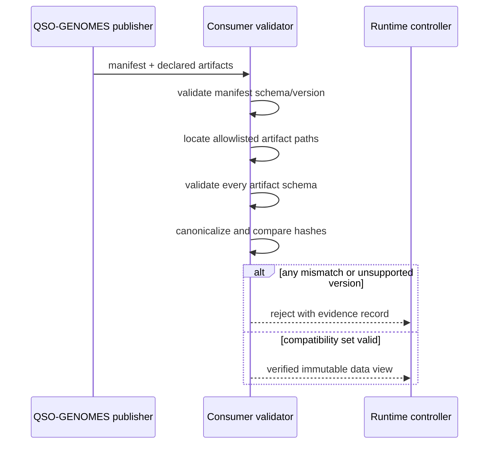

# Genome Compatibility Contract

This document defines the intended cross-repository contract between `QSO-GENOMES` and consumers such as `QuantumStateObjects`. It is a documentation contract until the schema, manifest, fixtures, validation commands, and hashes are committed and verified.

## Consumption rule

Consumers must treat this repository as a versioned data publisher. They may copy or download declared artifacts, validate them locally, and compare canonical hashes. They must not import repository code, evaluate genome fields, or execute content to discover compatibility.

## Compatibility manifest

The P1 manifest should be a closed, machine-readable object with fields equivalent to:

```json
{
  "contract": "qso.genome-compatibility",
  "contract_version": "1.0.0",
  "schema": {
    "path": "schemas/qso-genome.schema.json",
    "version": "1.0.0",
    "sha256": "<canonical-sha256>"
  },
  "immutable_ethics": {
    "path": "ethics/immutable-ethics.json",
    "version": "1.0.0",
    "sha256": "<canonical-sha256>"
  },
  "sprite": {
    "id": "aequitas",
    "path": "sprites/aequitas.json",
    "version": "1.0.0",
    "sha256": "<canonical-sha256>"
  },
  "genomes": [
    {
      "id": "atlas",
      "path": "genomes/atlas.json",
      "version": "1.0.0",
      "sha256": "<canonical-sha256>",
      "compatibility": "supported"
    }
  ]
}
```

The final paths and field names must follow the actual repository structure. The example does not authorize adding or moving files without an approved implementation task.

## Canonicalization

Hash stability requires one documented canonicalization method. The method should specify:

- UTF-8 encoding;
- Unicode normalization policy;
- object-key ordering;
- array-order semantics;
- number serialization;
- whitespace and newline handling;
- whether the hash covers a file byte stream or a canonical parsed representation.

A release must include a known-answer fixture and exact command that produces the recorded hash on a clean checkout.

## Validation sequence



## Fail-closed conditions

A consumer must reject the set when:

- the contract or schema version is unsupported;
- a required artifact is absent or duplicated;
- a path escapes the approved repository boundary;
- a canonical hash differs;
- an unknown genome or compatibility status appears without policy support;
- immutable ethics or supervisory references differ from those declared;
- a genome contains a prohibited capability or executable field;
- schema validation is ambiguous or incomplete.

Rejection should produce a bounded evidence record containing the manifest hash, failing artifact, reason code, validator version, and timestamp or deterministic experiment clock.

## Mutation and migration fixtures

P2 should include fixtures demonstrating:

| Fixture | Expected result |
|---|---|
| Mutable preference proposal recorded separately | Accepted as an inert proposal only |
| Attempt to alter immutable ethics | Rejected |
| Attempt to alter identity key or freeze authority | Rejected |
| Unsupported major schema version | Rejected |
| Supported migration with unchanged immutable fields | Accepted only after deterministic migration validation |
| Missing attribution or hash | Rejected |
| Embedded executable or command field | Rejected |

## Versioning policy

- **Patch:** clarification or fixture correction that does not change accepted data semantics.
- **Minor:** backward-compatible optional declarative fields supported by existing consumers.
- **Major:** incompatible schema, canonicalization, immutable-field, or manifest changes.

Compatibility decisions must be explicit. A consumer must never infer support from a numerically similar version.

## Evidence required for publication

- schema-validation results for all accepted fixtures;
- negative-test results for every fail-closed condition;
- canonicalization implementation and known-answer hashes;
- dependency and secret checks;
- manifest and artifact checksums;
- provenance manifest tied to the release commit;
- rollback instructions identifying the last verified compatibility set.
