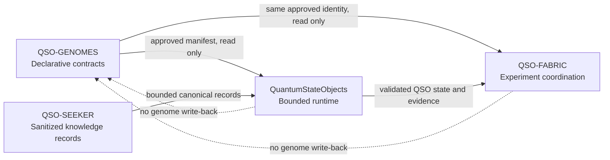
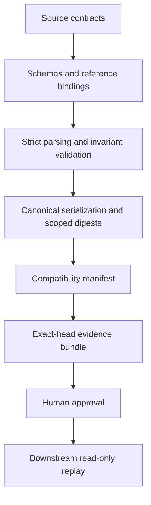
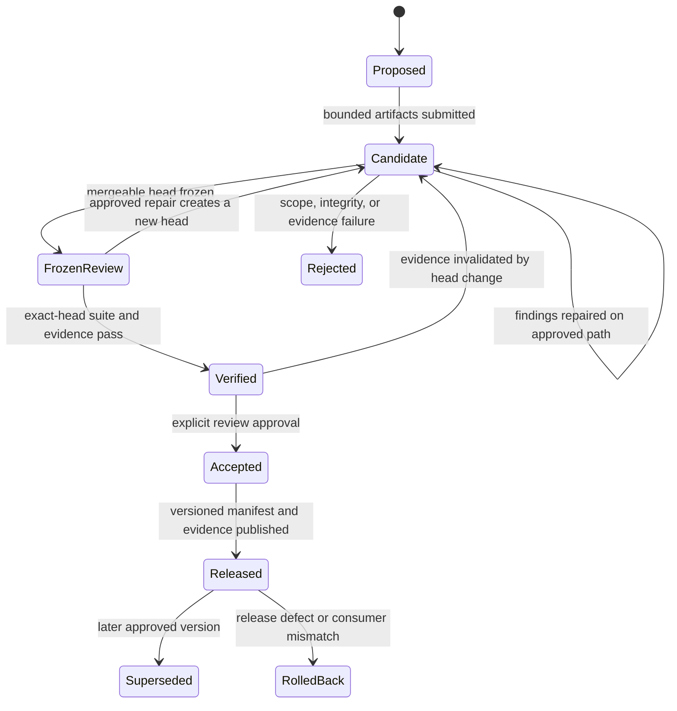
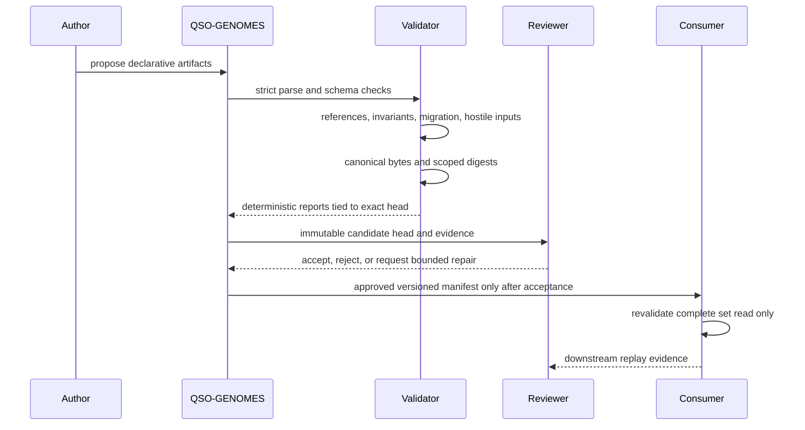
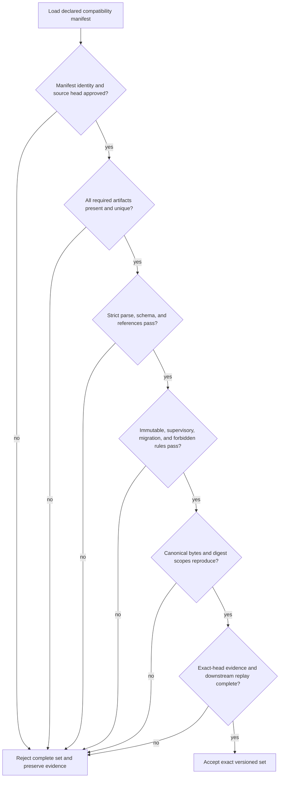
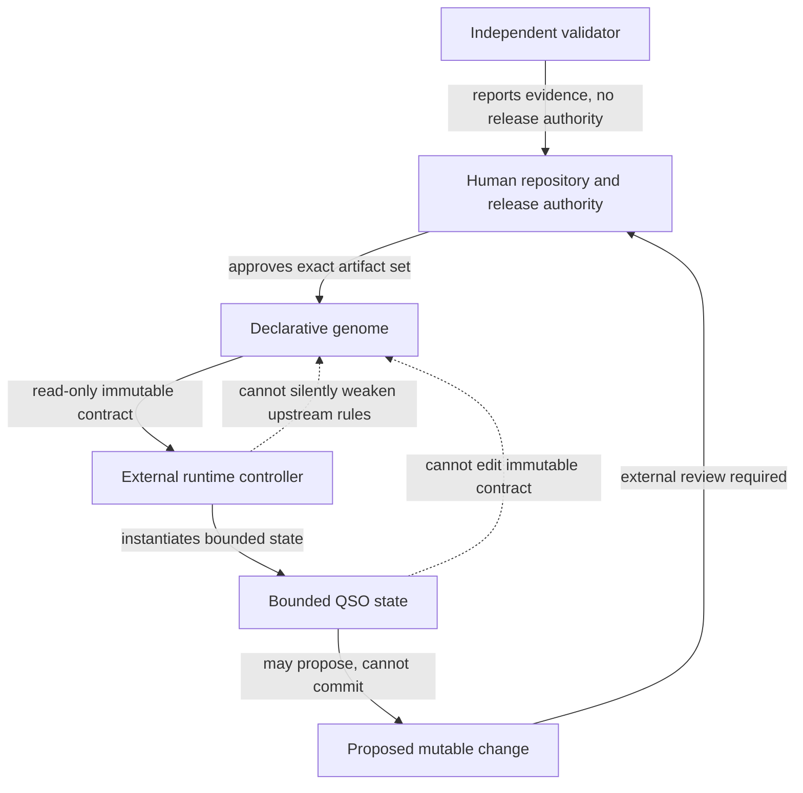
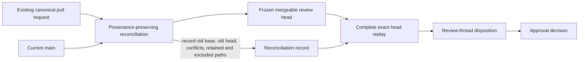
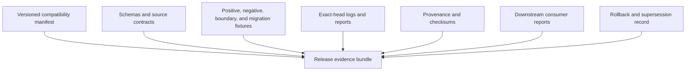

# Diagrams

The diagrams in this page are explanatory. They do not override schemas, lifecycle records, accepted manifests, or review decisions.

## Portfolio dependency direction

## Repository layers

## Candidate lifecycle

## Validation sequence

## Fail-closed decision tree

## Authority separation

## Reconciliation and evidence preservation

## Release artifact bundle

<!-- QSO-CONSENT-CAPACITY-LOCK-v1 -->
