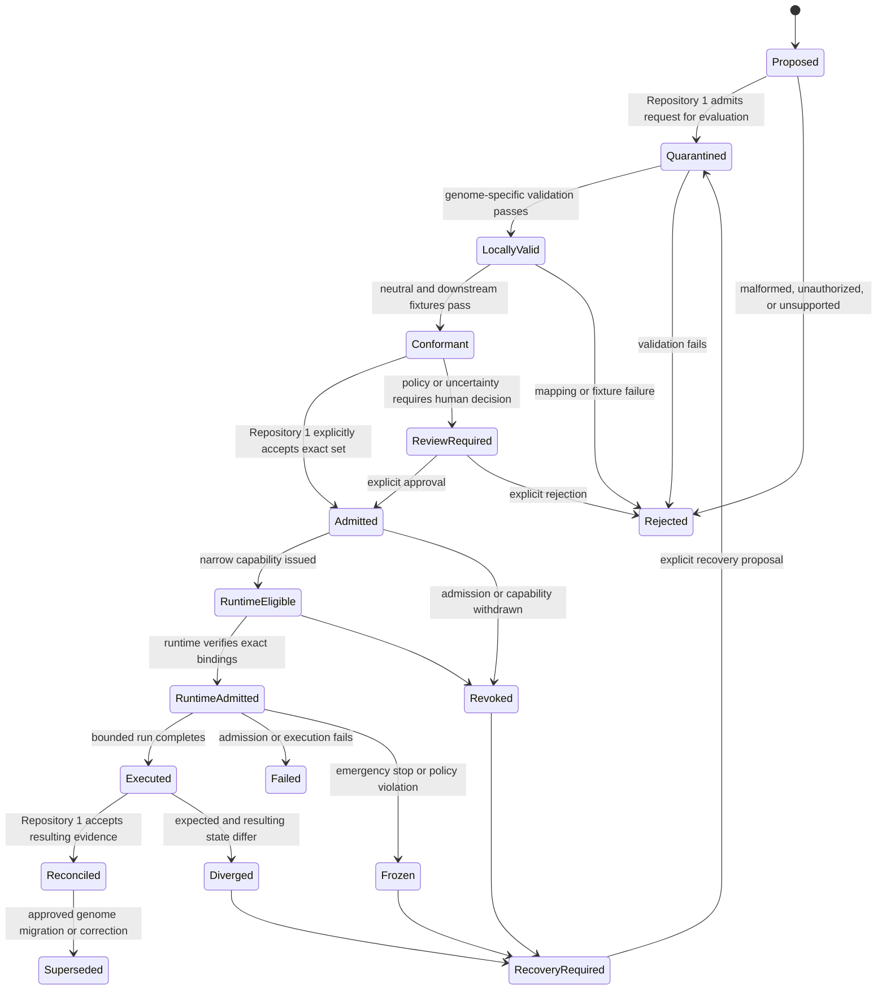

# Genome Admission and Runtime Projection Profile

## Purpose

This profile defines the lowest-authority candidate contract by which a reviewed QSO genome can be evaluated for operational use without allowing declarative identity, policy, lineage, or compatibility data to become a credential, capability, approval, runtime state transition, or canonical disposition.

The profile joins:

- **QSO-GENOMES**, which owns declarative genome identity, immutable policy, lineage, migrations, compatibility manifests, and genome-specific canonicalization;
- **Repository `1`** or an approved successor, which owns operational admission, capability issuance, revocation, canonical disposition, and recovery decisions;
- **QuantumStateObjects**, which owns bounded local runtime admission, interpretation, execution, and receipts;
- **QSO-FABRIC**, which owns multi-QSO experiment and collaboration orchestration;
- **`qsio-kernel`** or another approved conformance implementation, which may verify neutral contract vectors without becoming the operational runtime;
- **QSO-STUDIO and AionUi**, which may present reviewed projections without creating approval.

This document is a candidate integration profile. It does not accept a genome set, activate a runtime, issue a capability, designate a package owner, or approve any current pull request.

## Core invariant

> A genome may constrain what an admitted runtime is permitted to do, but a genome cannot admit itself, activate itself, issue its own capability, approve its own migration, or make its own execution canonical.

A locally valid genome is therefore necessary but never sufficient for operational use.

## Distinct record identities

The following identities must remain separate even when they refer to the same conceptual QSO:

| Record | Purpose | Owner | Must not be confused with |
|---|---|---|---|
| `genome_artifact_id` | Identifies one declarative genome document | QSO-GENOMES | Runtime instance, capability, approval |
| `genome_revision_id` | Identifies a lineage position or migration result | QSO-GENOMES | Operational freshness or activation |
| `compatibility_manifest_id` | Binds the reviewed artifact set and genome-specific profiles | QSO-GENOMES | Repository `1` acceptance receipt |
| `policy_commitment_id` | Identifies immutable policy content or protected commitment | QSO-GENOMES | Enforced stop or live authorization |
| `admission_request_id` | Requests operational evaluation of an exact genome set | Repository `0`, a human workflow, or another approved requester | Acceptance or capability |
| `quarantine_record_id` | Records Repository `1` admission into evaluation state | Repository `1` | Canonical acceptance |
| `genome_admission_id` | Records an explicit Repository `1` decision for an exact artifact set | Repository `1` | Runtime execution receipt |
| `capability_id` | Authorizes a narrow operation under an admitted genome | Repository `1` or approved issuer | Genome identity or policy |
| `runtime_admission_id` | Records QuantumStateObjects acceptance of exact inputs for one bounded run | QuantumStateObjects | Repository `1` canonical disposition |
| `runtime_instance_id` | Identifies one local runtime instance | QuantumStateObjects | Genome identity or human identity |
| `fabric_experiment_id` | Identifies one bounded collaboration or experiment | QSO-FABRIC | Runtime admission or canonical state |
| `conformance_run_id` | Identifies one deterministic compatibility evaluation | `qsio-kernel` or approved verifier | Operational admission |
| `execution_receipt_id` | Records what a bounded runtime attempted and observed | Runtime or executor | Canonical acceptance |
| `reconciliation_id` | Records Repository `1` comparison of expected and resulting state | Repository `1` | Execution success alone |
| `correction_id` | Records an approved correction or supersession | Appropriate contract or authority owner | Silent mutation of history |
| `revocation_id` | Records withdrawal of capability or operational admission | Repository `1` or approved revoker | Deletion of genome history |
| `recovery_checkpoint_id` | Binds a reviewed restart state | Repository `1` and recovery authority | Automatic unlock |

Identity collapse between any of these records is a release-blocking obstruction.

## Candidate admission envelope

A `genome-admission-request/v0` envelope should contain at minimum:

```yaml
profile: genome-admission-request/v0
request_id: <content-or-authority-bound identifier>
requested_at: <time with clock source and uncertainty>
requester:
  identity: <approved requester identity>
  authority_reference: <human decision, task, or bounded workflow>
subject:
  qso_identity: <declared QSO identity>
  intended_runtime_profile: <runtime profile identifier>
  intended_fabric_profile: <optional collaboration profile>
genome_set:
  repository: aevespers2/QSO-GENOMES
  commit: <immutable commit>
  compatibility_manifest_id: <manifest identity>
  manifest_digest: <domain-separated digest>
  artifacts:
    - path: <repository path>
      artifact_id: <genome artifact identity>
      artifact_digest: <artifact-byte digest>
  canonicalization_profile: <genome-specific profile>
  schema_versions: [<versions>]
policy:
  immutable_policy_id: <policy identity>
  forbidden_capability_profile: <profile identity>
  privacy_classification: <classification>
  retention_profile: <profile>
consumer_bindings:
  repository_1_policy: <admission policy version>
  runtime_repository: <repository and exact head>
  runtime_profile: <profile version>
  fabric_repository: <optional repository and exact head>
  fabric_profile: <optional profile version>
  conformance_profile: <neutral contract/fixture version>
limits:
  validity_window: <bounded interval>
  maximum_instances: <integer>
  resource_profile: <bounded resource policy>
  network_policy: <none unless independently authorized>
  persistence_policy: <none unless independently authorized>
rollback:
  required: true
  plan_reference: <reviewed rollback plan>
  recovery_owner: <named authority>
evidence:
  source_archive_digest: <digest>
  validation_report_ids: [<ids>]
  fixture_set_id: <immutable fixture set>
  limitations: [<known limitations>]
```

Unknown critical fields, missing exact source identity, unsupported versions, ambiguous digest scopes, or absent authority references must fail closed.

## Admission state machine



There is no automatic transition from `LocallyValid` or `Conformant` to `Admitted`, from `Executed` to `Reconciled`, or from `Frozen` to an active state.

## Repository `1` admission checks

Repository `1` or an approved successor must verify:

1. the request is authorized and bound to an exact requester;
2. the repository, commit, paths, manifest, schemas, policies, and digests are immutable and mutually consistent;
3. the active identity and historical-alias migration are approved;
4. the genome-specific canonicalization profile is supported;
5. the generic envelope, namespace, canonical bytes, and fixture owner are approved;
6. no declarative artifact contains or implies credentials, capabilities, live endpoints, secrets, repository-write authority, payment authority, or deployment authority;
7. the intended runtime and Fabric consumers are pinned to exact versions and supported profiles;
8. correction, supersession, revocation, privacy, retention, incident, rollback, and recovery references exist;
9. the request is fresh, non-replayed, non-revoked, and within resource and instance limits;
10. all unsupported or uncertain conditions remain explicit and fail closed.

Repository `1` may admit, reject, quarantine, revoke, or require human review. It must not rewrite genome history or silently repair genome artifacts.

## QuantumStateObjects runtime projection

QuantumStateObjects should derive a `genome-runtime-projection/v0` only after operational admission. The projection is a read-only runtime view, not a replacement genome.

The projection should include:

- exact genome artifact and revision identities;
- exact compatibility manifest and digest;
- allowed runtime profile and supported schema versions;
- immutable policy and forbidden-capability references;
- resolved traits and defaults with derivation provenance;
- explicit unknown, unsupported, and redacted fields;
- lifecycle mapping from genome revision states to runtime admission states;
- capability reference and expiry;
- resource, network, persistence, privacy, and tool limits;
- correction, revocation, freeze, and recovery references;
- the canonicalization and fixture versions used for admission.

The runtime projection must not contain live credentials. It may contain opaque references to capabilities held outside the genome and outside public artifacts.

## QSO-FABRIC collaboration projection

QSO-FABRIC should consume a separately versioned `genome-fabric-projection/v0` derived from the same admitted genome set. It may include collaboration-relevant identity, policy, role, compatibility, and constraint fields, but it must not:

- redefine genome identity, lineage, immutable policy, or migration;
- create new capabilities or broaden runtime capabilities;
- infer that membership in an experiment activates a genome;
- convert experiment success into canonical acceptance;
- persist a mutated genome as a new lineage record without an approved QSO-GENOMES migration path;
- bypass Repository `1` freeze, revocation, expiry, or recovery decisions.

Runtime and Fabric projections must identify the same source manifest and must either derive identical shared fields or fail compatibility.

## Conformance boundary

`qsio-kernel` or another approved verifier may evaluate deterministic vectors for:

- canonical genome bytes and domain-separated digests;
- schema, migration, lineage, reference, and immutable-field rules;
- supported-version negotiation;
- explicit mappings into neutral QSO or QSIO records;
- round-trip preservation and declared lossiness;
- unknown and critical field behavior;
- duplicate keys, invalid UTF-8, non-finite numbers, numeric boundaries, and tampering;
- runtime and Fabric projection equivalence for shared fields.

A successful conformance run demonstrates agreement with one fixture set. It does not issue operational admission, capability, approval, release, or canonical disposition.

## Pairwise gluing contracts

### QSO-GENOMES → Repository `1`

Producer evidence:

- exact reviewed source set;
- compatibility manifest;
- canonicalization and digest profiles;
- identity migration and alias rules;
- immutable policy and forbidden-capability profile;
- correction, supersession, privacy, and rollback metadata.

Consumer evidence:

- quarantine receipt;
- validation and policy decision;
- explicit admission or rejection;
- any capability issued separately;
- revocation and recovery state.

### QSO-GENOMES → QuantumStateObjects

Producer evidence:

- exact admitted genome set and runtime projection rules.

Consumer evidence:

- exact-source admission result;
- normalized projection;
- rejected-field and unsupported-version report;
- execution receipt bound to runtime admission.

### QSO-GENOMES → QSO-FABRIC

Producer evidence:

- exact admitted genome set and collaboration projection rules.

Consumer evidence:

- normalized collaboration projection;
- experiment admission result;
- proof that Fabric did not redefine lineage, policy, capabilities, or canonical state.

### QSO-GENOMES → `qsio-kernel`

Producer evidence:

- genome-specific canonicalization, mappings, and fixtures.

Consumer evidence:

- deterministic conformance report;
- supported and unsupported mapping matrix;
- round-trip, tamper, and lossiness results.

### QSO-GENOMES → QSO-STUDIO/AionUi

Producer evidence:

- approved public projection and protected-field classification.

Consumer evidence:

- read-only display with source identity, admission state, correction, revocation, redaction, and uncertainty indicators;
- proof that interface actions cannot create admission or approval.

## Required triple-overlap witnesses

### Genome → Repository `1` → runtime

Prove that local genome validity is insufficient for runtime use; the runtime accepts only the exact admitted set and narrow capability, rejects stale or replayed admission, and stops on revocation or freeze.

### Genome → runtime → Fabric

Prove that runtime and Fabric derive identical shared identity, policy, lineage, and compatibility fields from the same manifest; incompatible defaults or mappings fail closed.

### Genome → neutral contract → conformance implementation

Prove canonical bytes, identity namespaces, profile versions, mappings, and fixtures are owned outside implementation success; two implementations must reproduce the same accepted vectors.

### Identity migration → admission → cache

Prove only approved aliases resolve, retired identities cannot regain authority, Repository `1` refuses stale identity generations, and downstream runtime, Fabric, and interface caches invalidate consistently.

### Immutable policy → capability → execution

Prove genome policy constrains a separately issued capability, the capability cannot exceed immutable prohibitions, and runtime execution cannot broaden either record.

### Correction/revocation → runtime/Fabric → interface

Prove corrections and revocations invalidate admissions, capabilities, projections, caches, and displays without deleting historical provenance.

### Freeze → evidence preservation → recovery

Prove an emergency freeze stops new activation and bounded execution, preserves exact evidence, has no automatic unlock, and resumes only through a reviewed recovery checkpoint.

### Replacement environment → re-admission → bounded restart

Prove a valid genome does not automatically transfer operational authority to a new device, workspace, runtime head, or environment; every changed binding requires re-admission.

## Fail-closed fixture matrix

At minimum, the shared fixture set must include:

- missing artifact, manifest, schema, policy, migration, lineage, or reference;
- wrong repository, commit, path, digest, namespace, or profile version;
- duplicate keys, invalid UTF-8, non-finite values, numeric overflow, unknown critical fields, and tampering;
- conflicting aliases, retired identity, wrong identity generation, and unresolved migration;
- stale, replayed, expired, revoked, superseded, or corrected admission;
- wrong runtime, wrong Fabric head, wrong device, wrong workspace, or wrong environment;
- broadened capability, missing policy constraint, forbidden tool, unapproved network, or persistence request;
- runtime/Fabric projection mismatch;
- conformance implementation disagreement;
- partial execution, missing receipt, resulting-state mismatch, failed rollback, and incomplete recovery;
- public projection privacy leak, protected-field correlation, stale display, or failed cache invalidation.

## Material obstruction: validity, admission, and projection collapse

The current portfolio uses terms such as valid, compatible, accepted, active, admitted, loaded, executed, reconciled, released, and canonical across different repositories. Without this profile, a locally valid compatibility manifest or successful adapter/runtime test can be misrepresented as operational admission or portfolio acceptance.

The lowest-coupling repair is to preserve three explicit boundaries:

1. **Declarative validity** — QSO-GENOMES proves artifact and contract integrity.
2. **Operational admission** — Repository `1` decides whether an exact set may be used under a narrow policy and capability.
3. **Runtime projection and execution** — QuantumStateObjects and QSO-FABRIC derive bounded views and produce evidence, never canonical authority.

A fourth independent boundary—neutral contract conformance—proves semantic compatibility without granting any of the other three states.

## Acceptance criteria

This profile is ready for acceptance only when:

- the canonical compatibility-set and active identity model are approved;
- the neutral envelope, registry, namespace, serialization, canonicalization-interface, and fixture owner are designated;
- Repository `1` or a successor is approved for genome admission, capability, revocation, and recovery;
- QuantumStateObjects and QSO-FABRIC accept one shared immutable fixture set;
- `qsio-kernel` or another verifier reproduces accepted vectors independently;
- correction, supersession, privacy, retention, cache invalidation, incident, emergency-stop, and recovery owners are named;
- every pairwise and triple-overlap witness passes at immutable commits;
- explicit human approval records the accepted profile version.

## Scope boundary

This document adds integration semantics and test requirements only. It does not modify genome artifacts, schemas, migrations, aliases, policies, canonicalization code, adapters, runtime behavior, Fabric behavior, credentials, capabilities, admission state, release state, publication, deployment, or canonical operational state.

<!-- QSO-CONSENT-CAPACITY-LOCK-v1 -->
