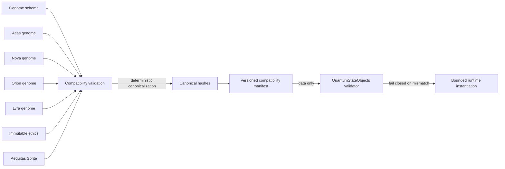

# QSO-GENOMES

QSO-GENOMES publishes canonical, declarative genome definitions for bounded Quantum State Objects. It is an upstream contract repository: consumers validate its data, versions, and hashes, but do not import it as executable runtime behavior.

> **Current maturity:** pre-release contract work. The four initial genomes, genome schema, immutable ethics, and Aequitas Sprite must be validated as one compatibility set before a cross-repository manifest can be published.

## Repository responsibilities

This repository owns:

- declarative genome schemas and genome documents;
- immutable ethics and supervisory Sprite references;
- compatibility manifests containing versions, paths, and canonical hashes;
- mutation-proposal and migration fixtures;
- negative fixtures proving immutable fields and unsupported versions fail closed.

It does not own:

- QSO runtime execution (`QuantumStateObjects`);
- network retrieval or sanitization (`QSO-SEEKER`);
- credentials, shell access, package installation, unrestricted networking, or self-replication;
- production payment authorization, custody, or settlement.

## Initial compatibility set

| Genome | Primary emphasis | Declarative boundary |
|---|---|---|
| Atlas | Structure, mathematics, algorithms, compression, cross-domain mapping | Configuration only; no embedded executable behavior |
| Nova | Verification, anomaly detection, security, testing, contradiction analysis | Configuration only; uncertainty and evidence rules remain explicit |
| Orion | Architecture, interfaces, protocols, systems composition | Configuration only; cannot expand runtime interfaces |
| Lyra | Language, ontology, epistemology, etymology, documentation, human context | Configuration only; attribution and interpretation boundaries remain explicit |

The compatibility set also includes the current genome schema, immutable ethics document, and Aequitas Sprite definition. A consumer must validate the set as a unit rather than mixing independently versioned files.

## Contract flow

## Required design invariants

- Genome content is data only and contains no executable instructions.
- Immutable ethics and identity constraints remain outside a QSO's writable state.
- Mutable changes are proposals until an external controller reviews and commits them.
- Goal evolution is bounded, attributable, reversible, and subordinate to immutable constraints.
- Every accepted version has deterministic canonical serialization and recorded hashes.
- Unknown fields, incompatible versions, altered hashes, and missing dependencies fail closed.
- External knowledge enters only through canonical records published by `QSO-SEEKER`.
- No schema field grants credentials, direct network authority, package installation, shell execution, or autonomous settlement.

## Delivery sequence

1. Validate all four genomes and supervisory constraints against the current schema.
2. Record deterministic canonical hashes and exact validation commands.
3. Publish a machine-readable compatibility manifest.
4. Add immutable-field, mutation-proposal, and migration fixtures.
5. Consider optional policy extensions only after their trust and settlement boundaries are separately approved.

## Release gates

No release is ready until:

- the task-chain acceptance criteria for the selected scope are complete;
- schema validation and negative fixtures pass deterministically;
- security checks prove prohibited executable and capability fields are absent;
- documentation matches the actual schema and manifest;
- provenance records commands, tool versions, hashes, and the release commit;
- consumers can validate fixtures without importing repository code;
- the release artifact includes schemas, fixtures, manifest, checksums, and rollback guidance.

## Documentation map

- [Compatibility contract](contract.md)
- [Task chain](../taskchain.md)
- [Release plan](../release.md)
- [Changelog](../changelog.md)
- [Root overview](../README.md)
