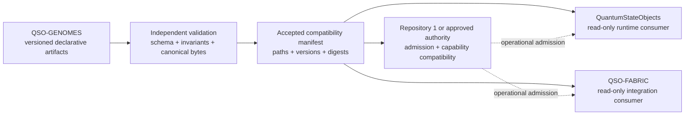

# QSO-GENOMES

**Canonical, reviewable genome contracts for bounded Quantum State Objects.**

QSO-GENOMES is the portfolio's upstream contract repository for declarative QSO identity, purpose, immutable safety rules, resource ceilings, communication limits, freeze behavior, provenance requirements, and narrowly bounded change proposals. A genome is data, not executable behavior. Runtime repositories may consume only a reviewed, versioned, hash-bound artifact set and must fail closed when any required identity, version, reference, or digest is missing or inconsistent.

!!! warning "Current lifecycle state"
    The first Atlas/Nova/Orion/Lyra compatibility set is **not released**. The authoritative release record remains blocked on provenance-preserving reconciliation, identity and scope disposition, a frozen mergeable head, exact-head conformance evidence, downstream replay, review disposition, and explicit approval.

!!! note "Portfolio gluing state"
    QSO-GENOMES now documents the unresolved boundaries between declarative identity, generic QSO formats, runtime interpretation, Fabric orchestration, Repository `1` capability authority, public projections, correction, revocation, and recovery. The gluing analysis is a contract-design and verification plan; it does not approve any identity migration, adapter, compatibility set, release, or operational authority.

!!! note "Accessibility review state"
    The accessibility protocol is `DOCUMENTED_NOT_CERTIFIED`. Source review, strict MkDocs construction, automated checks, rendered-artifact review, and assistive-technology review are separate evidence classes. No accessibility certification or Pages publication follows from the documentation build.

## Repository responsibility

QSO-GENOMES owns:

- declarative genome and supervisory definitions;
- schemas and versioning rules for those definitions;
- immutable-ethics and forbidden-capability contracts;
- genome-specific canonical serialization and digest requirements;
- compatibility-manifest structure and identity boundaries;
- migration records and fail-closed validation expectations;
- evidence requirements for downstream acceptance.

It does **not** own:

- QSO execution or scheduling;
- generic portfolio capability issuance or canonical operational state;
- network retrieval;
- credentials, secrets, or account access;
- payment execution;
- repository mutation by a QSO;
- deployment, orchestration, or production authorization.

## Initial bounded set

| Genome | Primary emphasis | Contract role |
|---|---|---|
| Atlas | structure, mathematics, algorithms, compression, cross-domain mapping | analytical organization |
| Nova | verification, anomaly detection, testing, contradiction analysis | independent challenge and validation |
| Orion | architecture, interfaces, protocols, systems composition | system and integration design |
| Lyra | language, ontology, epistemology, documentation, human context | interpretation and communication |

These descriptions are purpose-level summaries. The accepted artifact set, once approved, is authoritative—not this table.

## Contract flow

No consumer should import repository code to interpret the contracts. Consumers resolve an approved manifest, load only declared artifacts, verify canonical bytes and scoped digests, validate references and immutable constraints, and reject the complete set when validation is incomplete. Declarative compatibility and operational authority remain separate layers.

## Documentation map

- [Project overview](project-overview.md) — goals, users, lifecycle, ownership, and non-goals.
- [Architecture](architecture.md) — repository boundaries, artifact pipeline, trust zones, and dependency direction.
- [Contracts and invariants](contracts-and-invariants.md) — normative contract classes, canonicalization, manifests, migrations, and failure rules.
- [Genome admission and runtime projection](genome-admission-and-runtime-projection-profile.md) — identities, envelopes, state transitions, pairwise contracts, and overlap witnesses.
- [Capability evidence and self-edit review](capability-evidence-and-self-edit-review.md) — declared-versus-demonstrated evidence, bounded mutable changes, independent disposition, and rollback.
- [Accessibility and review evidence](accessibility-and-review-evidence.md) — exact-artifact binding, diagrams, keyboard, zoom, reflow, screen-reader, cognitive-access, correction, and certification boundaries.
- [Obstruction and gluing analysis](obstruction-and-gluing.md) — ownership conflicts, pairwise edges, triple-overlap witnesses, and lowest-coupling repair candidates.
- [Diagrams](diagrams.md) — system, lifecycle, validation, and review-flow diagrams.
- [Developer guide](developer-guide.md) — isolated setup, documentation build, contract-change workflow, testing expectations, and review evidence.
- [Security and governance](security-and-governance.md) — data-only boundary, authority separation, hostile-input posture, and approval controls.
- [Release and evidence](release-and-evidence.md) — current blocked posture, release gates, evidence bundle, and downstream acceptance.
- [Operations and rollback](operations-and-rollback.md) — incident handling, supersession, rollback, preservation, and recovery.
- [ADR-0001](adr/0001-data-only-authority.md) — why this repository remains declarative and non-executing.
- [ADR-0002](adr/0002-canonical-review-path.md) — why one immutable review path is required for the first compatibility release.
- [ADR-0003](adr/0003-separate-declarative-identity-from-operational-authority.md) — why genome identity and policy cannot themselves grant operational authority.

## Authoritative lifecycle records

The documentation site explains the repository, but lifecycle truth remains in the root records:

- [`taskchain.md`](https://github.com/aevespers2/QSO-GENOMES/blob/main/taskchain.md)
- [`release.md`](https://github.com/aevespers2/QSO-GENOMES/blob/main/release.md)
- [`punchlist.md`](https://github.com/aevespers2/QSO-GENOMES/blob/main/punchlist.md)
- [`changelog.md`](https://github.com/aevespers2/QSO-GENOMES/blob/main/changelog.md)

When prose and a lifecycle record disagree, stop and reconcile the contradiction before changing an artifact or release claim.

## Review principle

A contract is not accepted merely because it exists, parses, or passes a focused test. Acceptance requires one immutable reviewed head, reproducible validation, complete negative fixtures, explicit artifact identity, retained evidence, downstream read-only replay, review-thread disposition, and human approval. Operational use additionally requires an independently authorized admission or capability decision where applicable. Accessibility certification likewise requires exact rendered evidence and approved review; source documentation and strict build success are not enough.

<!-- QSO-CONSENT-CAPACITY-LOCK-v1 -->
