# Release and evidence

## Current posture

The repository's first compatibility release remains blocked. The root `release.md` is authoritative and currently requires a provenance-preserving reconciliation of the canonical review path, explicit scope containment, one immutable mergeable head, exact-head validation, complete review disposition, downstream replay, and human approval.

This page explains the evidence model. It does not change any gate status.

## Eligible first release

The first eligible semantic version identified by the release plan is `0.1.0-alpha.1`. Eligibility does not mean approval. A tag may be created only after every blocking gate is complete and the released artifacts are reproduced from the accepted head.

## Release-scope summary

The intended first alpha is limited to:

- Atlas, Nova, Orion, and Lyra genome contracts;
- required schemas;
- the approved immutable-ethics protocol and migration;
- forbidden-capability rules;
- the approved supervisory definition and exact reference bindings;
- canonical serialization and explicitly scoped SHA-256 identities;
- one complete compatibility manifest;
- deterministic positive, negative, boundary, conflict, migration, and hostile-input fixtures;
- exact-head validation and clean-checkout evidence;
- read-only replay in `QuantumStateObjects` and `QSO-FABRIC`;
- provenance, checksums, review disposition, security review, and rollback records.

Any additional supervisory identity, alias, repair authority, governance automation, network authority, credential access, payment authority, runtime behavior, or deployment surface is outside this release unless separately approved and versioned.

## Gate sequence

```mermaid
flowchart LR
    A[Canonical path and scope]
    B[Provenance-preserving reconciliation]
    C[Frozen mergeable head]
    D[Complete deterministic and hostile-input suite]
    E[Independent exact-head replay]
    F[Review-thread disposition and security review]
    G[Downstream read-only replay]
    H[Artifact and provenance bundle]
    I[Explicit approval]
    J[Versioned publication]

    A --> B --> C --> D --> E --> F --> G --> H --> I --> J
```



A later gate cannot compensate for an earlier failure. Publication is not permitted when the reviewed and built heads differ.

## Evidence bundle

A release evidence bundle should include:

### Source identity

- repository URL;
- accepted commit SHA;
- source archive checksum;
- base and reconciliation history;
- signed or otherwise independently recorded approval when available.

### Contract artifacts

- schemas;
- source contracts;
- immutable and forbidden-capability policies;
- supervisory definition and bindings;
- migrations;
- compatibility manifest;
- canonical bytes or reproducible generation instructions;
- artifact and set checksums with named scopes.

### Validation evidence

- exact commands;
- supported environment matrix;
- dependency versions;
- strict-parser results;
- schema and invariant reports;
- reference and migration reports;
- canonicalization test vectors;
- positive, negative, boundary, duplicate, conflict, overflow, and hostile-input results;
- final status tied to the accepted head.

### Review evidence

- pull-request and review-path identity;
- reconciliation record;
- scope-exclusion record;
- review-thread disposition map;
- security findings and resolutions;
- residual-risk statement;
- explicit approval record.

### Downstream evidence

For each consumer:

- exact consumer commit;
- accepted manifest identity;
- artifact and set digests observed;
- success cases;
- expected rejection cases;
- confirmation that consumption is read only;
- logs and report checksums;
- rollback result.

### Operations evidence

- publication location;
- checksum index;
- provenance manifest;
- rollback and supersession instructions;
- retention plan;
- incident contact or review owner.

## Evidence quality rules

Evidence is acceptable only when it is:

- tied to the exact reviewed head;
- reproducible from a clean checkout;
- complete for the stated gate;
- retained and reachable;
- explicit about tool versions and assumptions;
- consistent across local, CI, and downstream replay;
- clear about candidate versus accepted state;
- protected from silent replacement.

Screenshots, prose summaries, or generated reports without source identity may supplement evidence but do not replace reproducible records.

## Review-thread disposition

Every material finding should be mapped to the final frozen head with one of these outcomes:

- fixed and verified;
- accepted risk with named approver and rationale;
- no longer applicable, with proof;
- deferred to a separately versioned future scope;
- release blocking.

Outdated GitHub thread state alone does not prove a finding is no longer material.

## Downstream acceptance rule

The release is not compatible merely because one consumer accepts it. Both designated consumers must validate the same manifest version, canonicalization profile, artifact identities, set digest scope, immutable policy, supervisory identity, and rejection behavior.

If consumers disagree, the release remains blocked until the contract or consumer implementation is corrected and replayed.

## Publication layout

A release may use a structure similar to:

```text
qso-genomes-0.1.0-alpha.1/
├── manifest/
│   └── compatibility-manifest.json
├── contracts/
├── schemas/
├── migrations/
├── fixtures/
├── canonical/
├── reports/
├── downstream/
├── provenance/
├── rollback/
└── SHA256SUMS
```

This is a documentation model, not an assertion that these paths are currently published.

## Release rejection conditions

Reject or roll back when:

- reconciliation loses reviewed history or intended in-scope changes;
- the exact reviewed head changes without renewed evidence;
- an unapproved identity, alias, authority, or governance component enters the set;
- parser, canonicalizer, validator, or consumer behavior disagrees;
- required artifacts or references are absent or duplicated;
- immutable constraints are weakened;
- digest scopes are ambiguous or mismatched;
- exact-head CI or clean replay is missing;
- downstream consumers disagree;
- provenance or review disposition is incomplete;
- approval is absent.

## Documentation gate

Before release, documentation should accurately state:

- repository purpose and non-goals;
- artifact and identity model;
- canonicalization and digest scopes;
- consumer failure behavior;
- versioning and migration;
- security boundaries;
- reproducible validation commands;
- evidence bundle contents;
- rollback and supersession.

Documentation completeness cannot override a failed technical or approval gate.

<!-- QSO-CONSENT-CAPACITY-LOCK-v1 -->
